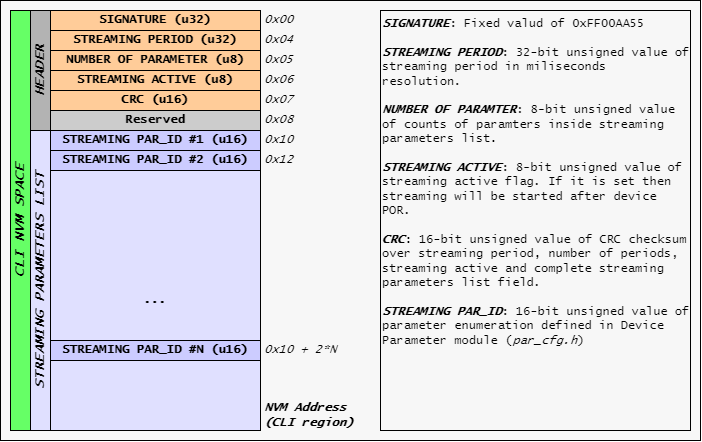
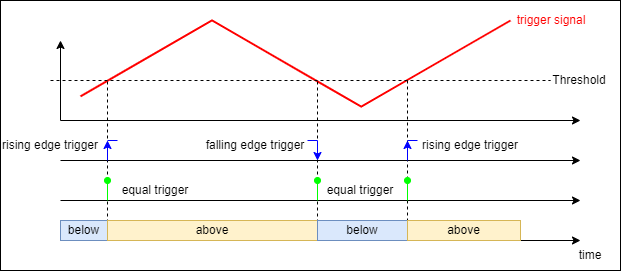
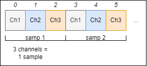
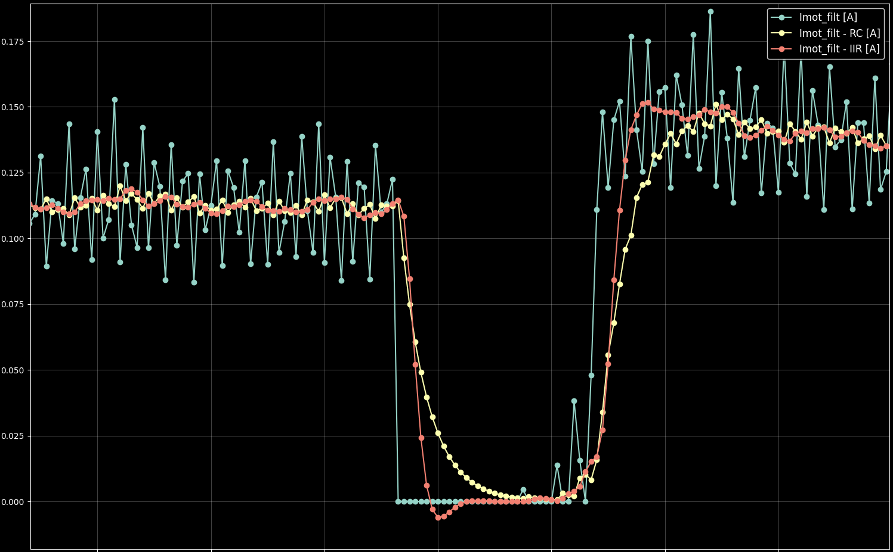

# **Command Line Interface - CLI**

A Command Line Interface (CLI) is a general-purpose, console-based interpreter that is independent of the communication medium. Its purpose is to easily and quickly set up embedded device configurations and perform diagnostics via an application-defined communication channel. The only constraint for the communication channel is the usage of ASCII-formatted streams. A CLI also has the ability to adjust embedded device parameters and enables advanced diagnostics, allowing real-time monitoring of changes in device parameters. Furthermore, for fast hard real-time requirements, it can observe device parameter values using a software oscilloscope, providing high-resolution time period observations.

CLI is build around command tables where command name, function and help message is specified and furthermore the context of each command. E.g.:
```C
// ----------------------------------------------------------------------------------
// 	name                    function                help string             context
// ----------------------------------------------------------------------------------
{   "help",                 cli_help,               "Print help message",   NULL	},
{   "intro",                cli_send_intro,         "Print intro message",  NULL	},
{   "reset",                cli_reset,              "Reset device",         NULL	},
```

CLI divides two types of command tables:
 - ***BASIC COMMAND TABLE***: Is compile-time defined by CLI module itself and highly depends on user configurations of module. Commands inside basic table serves for PC tool interfacing with the embedded device.
 - ***USER COMMAND TABLE***: Is run-time defined list of command defined by the user application purposes.

After defined ASCII string is received, a registrated function is raised. E.g. when device receives *help* string it raises following function:
```C
////////////////////////////////////////////////////////////////////////////////
/*!
* @brief        Show help
*
* @param[in]    p_cmd   - Pointer to command
* @param[in]	p_attr 	- Inputed command attributes
* @return       void
*/
////////////////////////////////////////////////////////////////////////////////
static void cli_help(const cli_cmd_t * p_cmd, const char * p_attr)
{
    UNUSED(p_cmd);

	// No additional attributes
	if ( NULL == p_attr )
	{
		cli_printf( " " );
		cli_printf( "    List of device commands" );
		cli_printf( "--------------------------------------------------------" );

		// Basic command table printout
		for ( uint32_t cmd_idx = 0; cmd_idx < gu32_basic_cmd_num_of; cmd_idx++ )
		{
			// Get name and help string
			const char * name_str = g_cli_basic_table[cmd_idx].name;
			const char * help_str = g_cli_basic_table[cmd_idx].help ;

			// Left adjust for 25 chars
			cli_printf( "%-25s%s", name_str, help_str );
		}

		// User defined tables
		for ( uint32_t cmd_idx = 0; cmd_idx < CLI_CFG_MAX_NUM_OF_USER_TABLES; cmd_idx++ )
		{
            // Are there any commands
            if ( g_cli_user_tables[cmd_idx].num_of > 0U )
            {
                // Print separator between user commands
                cli_printf( "--------------------------------------------------------" );

                // Show help for that table
                for ( user_cmd_idx = 0; user_cmd_idx < g_cli_user_tables[cmd_idx].num_of; user_cmd_idx++ )
                {
                    // Get name and help string
                    const char * name_str = g_cli_user_tables[cmd_idx].p_cmd[user_cmd_idx].name;
                    const char * help_str = g_cli_user_tables[cmd_idx].p_cmd[user_cmd_idx].help;

                    // Left adjust for 25 chars
                    cli_printf( "%-25s%s", name_str, help_str );
                }
            }
		}

		// Print separator at the end
		cli_printf( "--------------------------------------------------------" );
	}
	else
	{
		cli_util_unknown_cmd_rsp();
	}
}
```

### **Using CLI in RTOS environment**

When using CLI module with RTOS make sure to prepare mutex functions inside interface file ***cli_if.c***. Mutex must have the **recursive** property as it might happent that mutex will be taken multiple times by the same task. 

Example of CLI interface file when using FreeRTOS with CMSIS v2:
```C
////////////////////////////////////////////////////////////////////////////////
// Definitions
////////////////////////////////////////////////////////////////////////////////

// USER CODE BEGIN..

/**
*      CLI mutex timeout
*
*  Unit: ms
*/
#define CLI_IF_MUTEX_TIMEOUT_MS                 ( 10U )

// USER CODE END...

////////////////////////////////////////////////////////////////////////////////
// Variables
////////////////////////////////////////////////////////////////////////////////

// USER CODE BEGIN...

/**
*  CLI OS mutex
*/
static osMutexId_t  g_cli_mutex_id = NULL;
const osMutexAttr_t g_cli_mutex_attr =
{
    .name       = "cli",
    .attr_bits  = ( osMutexPrioInherit | osMutexRecursive ),	// IMPORTANT TO BE A RECURSIVE!!!
};

// USER CODE END...

// ...

////////////////////////////////////////////////////////////////////////////////
/**
*		Initialize Command Line Interface communication port
*
* @return 		status 	- Status of operation
*/
////////////////////////////////////////////////////////////////////////////////
cli_status_t cli_if_init(void)
{
    cli_status_t status = eCLI_OK;

    // USER CODE BEGIN...

    if ( eUART_OK != uart_init( eUART_DBG ))
    {
        status = eCLI_ERROR_INIT;
    }
    else
    {
        // Create mutex
        g_cli_mutex_id = osMutexNew( &g_cli_mutex_attr );

        if ( NULL == g_cli_mutex_id )
        {
            status = eCLI_ERROR;
        }
    }

    // USER CODE END...

    return status;
}

////////////////////////////////////////////////////////////////////////////////
/**
*		Acquire mutex
*
* @note	User shall provide definition of that function based on used platform!
*
*		If not being used leave empty.
*
* @return 		status - Status of operation
*/
////////////////////////////////////////////////////////////////////////////////
cli_status_t cli_if_aquire_mutex(void)
{
    cli_status_t status = eCLI_OK;

    // USER CODE BEGIN...

    if ( osOK == osMutexAcquire( g_cli_mutex_id, CLI_IF_MUTEX_TIMEOUT_MS ))
    {
        // No action
    }
    else
    {
        status = eCLI_ERROR;
    }

    // USER CODE END...

    return status;
}

////////////////////////////////////////////////////////////////////////////////
/**
*       Release mutex
*
* @note	User shall provide definition of that function based on used platform!
*
*       If not being used leave empty.
*
* @return   status - Status of operation
*/
////////////////////////////////////////////////////////////////////////////////
cli_status_t cli_if_release_mutex(void)
{
    cli_status_t status = eCLI_OK;

    // USER CODE BEGIN...

    osMutexRelease( g_cli_mutex_id );

    // USER CODE END...

    return status;
}

```

## **Dependencies**

### **1. Utils Module**
[Utils module](https://github.com/GeneralEmbeddedCLibraries/utils) is a mandatory dependecy when using CLI and it must take following path:
```
"root/common/utils/src/utils.h"
```

### **2. Device Parameters**
In case of using parameters *CLI_CFG_PAR_USE_EN = 1*, then [Device Parameters](https://github.com/GeneralEmbeddedCLibraries/parameters) must pe part of project. 
Device Parameters module must take following path:
```
"root/middleware/parameters/parameters/src/par.h"
```

### **3. NVM Module**
In case of using NVM module *CLI_CFG_STREAM_NVM_EN = 1*, then [NVM module](https://github.com/GeneralEmbeddedCLibraries/nvm) must pe part of project. 
NVM module must take following path:
```
"root/middleware/nvm/nvm/src/nvm.h"
```

## **Limitations**

### **1. ASCII Base Interface**
CLI is ASCII based communication interface therefore all received command shall be fully in ASCII format. Limitation here is that CLI module do no support binary data stream in command attributes nor in command name.

## **General Embedded C Libraries Ecosystem**
In order to be part of *General Embedded C Libraries Ecosystem* this module must be placed in following path: 

```
root/middleware/cli/cli/"module_space"
```

## **API**
| API Functions | Description | Prototype |
| --- | ----------- | ----- |
| **cli_init** 					| Initialization of CLI module 								| cli_status_t cli_init(void) |
| **cli_deinit** 				| De-initialization of CLI module 							| cli_status_t cli_deinit(void) |
| **cli_is_init** 				| Get initialization status 								| cli_status_t cli_is_init(bool * const p_is_init) |
| **cli_hndl** 					| Main handler for CLI module 								| cli_status_t cli_hndl(void) |
| **cli_send_str** 				| Send string thrugh CLI COM port 				            | cli_status_t cli_send_str(const uint8_t * const p_str) |
| **cli_printf** 				| Print formated string thrugh CLI COM port 				| cli_status_t cli_printf(char * p_format, ...) |
| **cli_printf_ch** 			| Print COM channel formated string thrugh CLI COM port 	| cli_status_t cli_printf_ch(const cli_ch_opt_t ch, char * p_format, ...) |
| **cli_register_cmd_table** 	| Register user define CLI command table 					| cli_status_t cli_register_cmd_table(const cli_cmd_t * const p_cmd_table, const uint8_t num_of_cmd) |
| **cli_osci_hndl** 			| Oscilloscope handler										| cli_status_t cli_osci_hndl(void)|

## **Usage**

**GENERAL NOTICE: Put all user code between sections: USER CODE BEGIN & USER CODE END!**

1. Copy template files to root directory of module.
2. Configure CLI module for application needs. Configuration options are following:

| Configuration | Description |
| --- | --- |
| **CLI_CFG_INTRO_STRING_EN** 			| Enable/Disable introduction string at CLI initialization. |
| **CLI_CFG_INTRO_PROJECT_NAME** 		| Project name string. Part of intro string. |
| **CLI_CFG_INTRO_SW_VER** 				| Software version. Part of intro string. |
| **CLI_CFG_INTRO_HW_VER** 				| Hardware version. Part of intro string. |
| **CLI_CFG_INTRO_BOOT_VER** 		    | Bootloader version. Part of intro string. |
| **CLI_CFG_INTRO_PROJ_INFO** 			| Project detailed info. Part of "revision" module. |
| **CLI_CFG_ARBITRARY_RAM_ACCESS_EN**   | Enable/Disable arbitrary RAM access functionality |
| **CLI_CFG_TERMINATION_STRING** 		| String that will be send after each "cli_printf" and "cli_printf_ch". |
| **CLI_CFG_TX_BUF_SIZE** 				| Transmitting buffer size in bytes. |
| **CLI_CFG_RX_BUF_SIZE** 				| Reception buffer size in bytes. |
| **CLI_GET_SYSTICK** 				    | Get system timetick in 32-bit unsigned integer form. |
| **CLI_CFG_PAR_USE_EN** 				| Enable/Disable usage of Device Parameters. |
| **CLI_CFG_HNDL_PERIOD_MS** 			| Time period of "cli_hndl()" function call in ms. (Applicable only if CLI_CFG_PAR_USE_EN=1) |
| **CLI_CFG_DEF_STREAM_PER_MS** 		| Defaulf time period of parameter streaming in ms. (Applicable only if CLI_CFG_PAR_USE_EN=1) |
| **CLI_CFG_PAR_MAX_IN_LIVE_WATCH** 	| Maximum number of parameter in streaming list. (Applicable only if CLI_CFG_PAR_USE_EN=1) |
| **CLI_CFG_STREAM_NVM_EN** 			| Enable/Disable storing streaming info to NVM. (Applicable only if CLI_CFG_PAR_USE_EN=1) |
| **CLI_CFG_NVM_REGION** 				| CLI NVM region space. (Applicable only if CLI_CFG_STREAM_NVM_EN=1) |
| **CLI_CFG_AUTO_STREAM_STORE_EN** 		| Enable/Disable automatic storing of streaming info to NVM. (Applicable only if CLI_CFG_STREAM_NVM_EN=1). If enabled streaming info will be stored after following command is executed: *watch_des*, *watch_start*, *watch_stop* and *watch_rate*. |
| **CLI_CFG_PAR_OSCI_EN** 				| Enable/Disable usage of software oscilloscope |
| **CLI_CFG_PAR_MAX_IN_OSCI** 			| Maximum number of parameters in oscilloscope list |
| **CLI_CFG_PAR_OSCI_SAMP_BUF_SIZE** 	| Oscilloscope sample buffer size. Unit: byte |
| **CLI_CFG_PAR_OSCI_SECTION** 			| Section name of Oscilloscope specific data linkage |
| **CLI_CFG_DEBUG_EN** 					| Enable/Disable debugging mode. |
| **CLI_CFG_ASSERT_EN** 				| Enable/Disable asserts. Shall be disabled in release build! |
| **CLI_ASSERT** 						| Definition of assert |

3. Configure communication channels if needed. See **Defining communication channels** chapter bellow.
4. Prepare interface files *cli_if.c* and *cli_if.h*. All examples are inside *template* folder.
5. Initilize CLI module:
	```C
	// Initialize CLI
	if ( eCLI_OK != cli_init())
	{
		// Initialization error...
		// Furhter actions here...
	}
	```
6. Register wanted cli commands. See **Registration of user command** chapter bellow.
7. Make sure to call *cli_hndl()* at fixed period (e.g. 10ms):
	```C
	// 10 ms loop
	if ( flags & SHELL_TIMER_EVENT_10_MS )
	{
		// Handle Command Line Interface
		cli_hndl();
	}
	```

### **Registration of user command**

Registration of user command is done in run-time with no pre-conditions. Maximum number of commands is limited to *uint8_t* data type, meaning 255. Additionally there is also maximum number of all user table limitation. It is adjustable by *CLI_CFG_MAX_NUM_OF_USER_TABLES* macro inside *cli_cfg.h*.

Example of registration of user defined CLI command table:

```C
// User test_1 function definiton
void test_1(const cli_cmd_t * p_cmd, const char * p_attr)
{
    // Unused command info
    UNUSED(p_cmd);

    if ( NULL != attr ) cli_printf("User command test 1... Attr: <%s>", attr);
    else                cli_printf("User command test 1... Attr: NULL");
}

// User test_2 function definiton
void test_2(const cli_cmd_t * p_cmd, const char * p_attr)
{
    // Get my context
    void * p_context = p_cmd->p_context;

    if ( NULL != attr ) cli_printf("User command test 2... Attr: <%s>", attr);
    else                cli_printf("User command test 2... Attr: NULL");
}

// User test_3 function definiton
void test_3(const cli_cmd_t * p_cmd, const char * p_attr)
{
    // Unused command info
    UNUSED(p_cmd);

    if ( NULL != attr ) cli_printf("User command test 3... Attr: <%s>", attr);
    else                cli_printf("User command test 3... Attr: NULL");
}

// User test_4 function definiton
void test_4(const cli_cmd_t * p_cmd, const char * p_attr)
{
    // Unused command info
    UNUSED(p_cmd);

    if ( NULL != attr ) cli_printf("User command test 4... Attr: <%s>", attr);
    else                cli_printf("User command test 4... Attr: NULL");
}

// Define user table
CLI_DEFINE_CMD_TABLE( my_table,

    // ----------------------------------------------------------------------
    //  name        function        help string         context
    // ----------------------------------------------------------------------
    {   "test_1",   test_1,         "Test 1 Help",      NULL },      
    {   "test_2",   test_2,         "Test 2 Help",      NULL },
    {   "test_3",   test_3,         "Test 3 Help",      NULL },
    {   "test_4",   test_4,         "Test 4 Help",      NULL },        
);

void register_my_cli_commands()
{
    // Register CLI commands
    cli_register_cmd_table( &my_table );
}
```

### **Defining communication channels**

NOTICE: Change only code between ***USER CODE BEGIN*** and ***USER CODE END*** sections:

1. Define communication channels enumerations inside *cli_cfg.h*. 
```C
/**
    * 		List of communication channels
    *
    * @note	Warning and error communication channels must
    * 			always be present!
    *
    * 	@note	Change code only between "USER_CODE_BEGIN" and
    * 			"USER_CODE_END" section!
    */
typedef enum
{
    eCLI_CH_WAR = 0,    /**<Warning channel */
    eCLI_CH_ERR,        /**<Error channel */

    // USER_CODE_BEGIN

    eCLI_CH_APP,        /**<Application level channel */

    // USER_CODE_END

    eCLI_CH_NUM_OF
} cli_ch_opt_t;
```

2. Define channel name and default state of each comunication channel inside *cli_cfg.c*:
```C
/**
*       Communication channels names and default active
*       state definition
*
*   @note   Change code only between "USER_CODE_BEGIN" and
*           "USER_CODE_END" section!
*/
static cli_cfg_ch_data_t g_cli_ch[eCLI_CH_NUM_OF] =
{
    // --------------------------------------------------------------------------
    //                      Name of channel             Default state of channel
    // --------------------------------------------------------------------------
    [eCLI_CH_WAR]       = { .name = "WARNING",          .en = true              },
    [eCLI_CH_ERR]       = { .name = "ERROR",            .en = true              },

    // USER_CODE_BEGIN

    [eCLI_CH_APP]       = { .name = "APP",              .en = true              },

    // USER_CODE_END
};
```

### **Using device parameters**

1. Make sure to have [Device Parameter](https://github.com/GeneralEmbeddedCLibraries/parameters) up and running. It is mandatory to use *General Embedded C Libraries Ecosystem* path for parameters module (*root/middleware/parameters/parameters/*) !

2. Enable following *CLI_CFG_PAR_USE_EN* macro by setting it to "1" inside *cli_cfg.h* file:
```C
/**
    *           Enable/Disable parameters usage
    *
    *   @brief	Usage of device parameters.
    *           Link to repository: https://github.com/GeneralEmbeddedCLibraries/parameters
    */
#define CLI_CFG_PAR_USE_EN                          ( 1 )
```

Now you have everything setup to use Device Parameters module in combination with CLI.


### **Storing streaming info to NVM**

Main purpose of storing streaming (live watch) info to NVM is than after power-on or reset of the device you don't have to configure streaming (live watch) config over again. Therefore if using that feature, device will boot and setup stored streaming configuration. Meaning that if device was configured to stream specific parameters for specific measurement it will start sending parameters value right after boot, without any configuration needed. This can save a lot of time when performing extensive measurements.

Streaming (or live watch) info consist of:
 - list of stream paramter enumerations
 - number of parameters in list
 - streaming period
 - streaming active flag

When CLI module is configured to store streaming info to NVM (*CLI_CFG_STREAM_NVM_EN* = 1) user must also include [NVM module](https://github.com/GeneralEmbeddedCLibraries/nvm) into project. Additionally user must define NVM region for CLI storage purposes inside *nvm_cfg.h/.c*. Name of NVM region must be pass to CLI configuration to *CLI_CFG_NVM_REGION* macro.

Code section from *nvm_cfg.h*:
```C
/**
 * 		NVM region definitions
 *
 *	@brief	User shall specified NVM regions name, start, size
 *			and pointer to low level driver.
 *
 * 	@note	Special care with start address and its size!
 */
static const nvm_region_t g_nvm_region[ eNVM_REGION_NUM_OF ] =
{
    // --------------------------------------------------------------------------------------------------------------------------------------------------------------------
    //                                      Region Name                 Start address           Size [byte]         Low level driver
    // -------------------------------------------------------------------------------------------------------------------------------------------------------------------- 
    [eNVM_REGION_EEPROM_DEV_PAR]    =   { .name = "Device Parameters",  .start_addr = 0x000U,   .size = 1024U,      .p_driver = &g_mem_driver[ eNVM_MEM_DRV_EEPROM ]    },
    [eNVM_REGION_EEPROM_CLI]        =   { .name = "CLI settings",       .start_addr = 0x400U,   .size = 256U,       .p_driver = &g_mem_driver[ eNVM_MEM_DRV_EEPROM ]    },  
    // --------------------------------------------------------------------------------------------------------------------------------------------------------------------
};
```

Code section from *cli_cfg.h*:
```C
/**
 *      Enable/Disable storing streaming info to NVM
 *
 *  @note   When enabled NVM module must be part of the project!
 *          Link to repository: https://github.com/GeneralEmbeddedCLibraries/nvm
 */
#define CLI_CFG_STREAM_NVM_EN              ( 1 )

/**
 *      NVM parameter region option
 *
 *  @note   User shall select region based on nvm_cfg.h region
 *          definitions "nvm_region_name_t"
 */
#define CLI_CFG_NVM_REGION                 ( eNVM_REGION_EEPROM_CLI )
```

CLI NVM memory layout and field description is shown in picture below:


Additional option is to enable automatic storage of streaming info via *CLI_CFG_AUTO_STREAM_STORE_EN* macro. This feature provides refreshing of streaming info inside NVM each time it changes in RAM. Meaning that each time either of streaming info data is being change by user it re-writes new streaming configuration to NVM. This routine is triggered on execution of following CLI command:
 - *watch_channel*
 - *watch_start*
 - *watch_stop*
 - *watch_rate* 

Code section from *cli_cfg.h*:
```C
/**
 *     Enable/Disable automatic storage of streaming info to NVM
 *
 * @note   When enabled streaming info is stored on following 
 *         commands execution:
 *              - watch_channel
 *              - watch_start
 *              - watch_stop
 *              - watch_rate
 */
#define CLI_CFG_PAR_AUTO_STREAM_STORE_EN      ( 0 )
```


### **Software Oscilloscope**
Software oscilloscope enable us to observe device paramater value in high resolution (based on how fast osci handle is being called), it enables various triggering options and option to downsample as well.

Software oscilloscope features following trigger types:
 1. **None**: Continous mode
 2. **Rising edge**: Gets triggered when signal raises above threshold value
 3. **Falling edge**: Gets triggered when signal falls below threshold value
 4. **Both edges**: Gets triggered either if signal falls or raises below/above threshold value
 5. **Equal**: Gets triggered when signal equals threshold value
 6. **Above**: Gets triggered when signal is lower than threshold value
 7. **Below**: Gets triggered when signal is higher that thresold value



Oscilloscpe has also pre-trigger ability, to store signal before triggering. It can be configured from 0% - 100%, where 0% means zero pre-trigger samples.

Sample buffer accumulates all samples (parameters values) into signle array in form of a sequential order in respect to channel configuration. In picture below there is example of osci configured with 3 channels:




#### **Usage**

**1. Software Oscilloscope needs to be enabled in **cli_cfg.h**:**
```C
/**
 *     Enable/Disable usage of software oscilloscope
 */
#define CLI_CFG_PAR_OSCI_EN                   ( 1 )
```
NOTICE: When using oscilloscope, it's mandatory to use [Device Parameters](https://github.com/GeneralEmbeddedCLibraries/parameters) module!


**2. (OPTIONAL) Link oscilloscope sample buffer to specific memory location:**

Example of linking osci buffer to CCMRAM on STM32G431:
```C
/**
 *     Section name of Oscilloscope specific data linkage
 */
#define CLI_CFG_PAR_OSCI_SECTION                ( ".ccmData" )
```

Part of *STM32G432RBTX_FLASH.ld* linker script:
```
  /*--- New CCMRAM linker section definition ---*/
  _siccmram = LOADADDR(.ccmram);
  
  /* Program CCMRAM section */
  .ccmram :
  {
    . = ALIGN(4);
    _sccmram = .; /* define a global symbols at ccmram start */
    *(.ccmData)
    *(.ccmData*)
    *(.ccmFunc)
    *(.ccmFunc*)
    
    . = ALIGN(4);
    _eccmram = .; /* define a global symbols at ccmram end */
    
  } >CCMRAM AT> FLASH
  
  /*--- End of CCMRAM linker section definition ---*/
```

**3. Handle oscilloscope:**
```C
// Typical ADC End-Of-Conversion ISR
void ADC_EOC_ISR(void)
{
    // Other hard real-time stuff...

    // Handle Oscilloscope
    cli_osci_hndl();
}
```

**4. Configure, start and get data via CLI commands using your preferred terminal:**
```C
// First stop osci
osci_stop\r\n

// Configure osci
osci_channel 201,202\r\n
osci_trigger 0,201,0.025,0.5\r\n
osci_downsample 1\r\n

// Run osci
osci_start\r\n

// Wait for sampling to finish...

osci_data\r\n   // Get data
```

Example of software oscilloscope usage in real life case, sample frequency was 8kHz with falling edge trigger:




### **Direct RAM access**
When *CLI_CFG_ARBITRARY_RAM_ACCESS_EN* is enabled then make sure to provide *cli_if_check_ram_addr_range* interface function so that valid RAM address can be accesed by the user over the CLI.

Enable given switch in *cli_cfg.h*:
```C
/**
 * 	Enable/Disable arbitrary RAM access functionality
 */
#define CLI_CFG_ARBITRARY_RAM_ACCESS_EN         ( 1 )
```

Provide RAM valid address for access checking in *cli_if.c*:
```C
////////////////////////////////////////////////////////////////////////////////
/**
*		Check if specified RAM address range is valid and can be accessed
*
* @param[in]    addr   - RAM address
* @param[in]    size   - Range size [byte]
* @return 		status - Status of operation
*/
////////////////////////////////////////////////////////////////////////////////
cli_status_t cli_if_check_ram_addr_range(const uint32_t addr, const uint32_t size)
{
    // NOTICE: Following example is for nRF52840 chipset using Segger Embedded Studio IDE!

    // Linker symbols specifying entire RAM range, including SoftDevice reserved region
    extern uint32_t __RAM1_segment_start__[];
    extern uint32_t __RAM1_segment_end__[];

    cli_status_t status = eCLI_OK;

    // Start address is inclusive and end address is exclusive.
    // Additionally check for range overflow.
    if ((addr < (uint32_t)__RAM1_segment_start__) || ((addr + size) > (uint32_t)__RAM1_segment_end__) || ((addr + size) < addr))
    {
        status = eCLI_ERROR;
    }

    return status;
}
```
